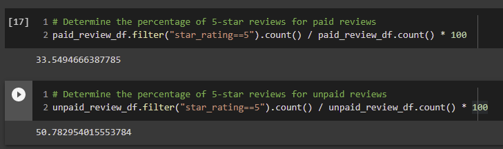

# Amazon Vine Analysis
## Overview of the analysis
The following analysis of Amazon reviews of books examines whether there is a positive bias in the reviews of books by Vine members. 

## Method: 
The analysis was performed using PySpark in the following steps: 
1. Book dataset was reduced to a dataframe containing "review_id", "star_rating", "helpful_votes", "total_votes", "vine", "verified_purchase" columns. The dataframe was further filtered to retrieve the rows where <total_votes> is equal to or greated than 20.
2.  Further filter the DataFrame to retrieve all the rows where half of the <total_votes> is <helpful_votes>
3.  Further filter the DataFrame first for rows that contain paid reviews, then for rows that contain unpaid reviews. 
4.  Analysis of distribution of 5-star votes in paid and unpaid reviews.

## Results: 
* There are a total of 0 Vine reviews when dataset is filtered for rows that contain total_votes > 20. This is confirmed by filtering the original dataset for Vine reviews. Note that both rows contain <total_votes> less than 20, therefore were left out.

* There are a total of 403807 unpaid, or non-Vine reviews, i.e. the total number of votes in the filtered dataset. 

* Given that there are 0 Vine reviews, all the 242889 5-star reviews were done by non-Vine members.
 
Confirmation that all 5-star reviews are by non-Vine members:

* 60% of the non-Vine reviews are 5-Star reviews.

## Summary: 
Analysis shows no evidence of bias in the reviews given that nearly all the reviews were done by non-Vine members. For this reason, the analysis of second dataset of books (...v1_01.tsv.gz) was conducted. Please see the results below. Please see script Vine_Review_Analysis_2.ipynb in the repository. 

## Results for [...]v1_01.tsv.gz dataset:

* There are 4781 Vine reviews and 332395 non-Vine Reviews. 
 
* Out of all the total 5-star reviews, less than 1% are done by Vine members, and 99% of the 5-Star reviews are done by non-Vine members. 
 
* 33.5% of Vine reviews are 5-Stars, while 50.7% of non-Vine reviews are 5-star. 
 

## Summary for [...]v1_01.tsv.gz dataset: 
While the second analysis includes more Vine reviews, it supports the findings in the original analysis. Namely, that the datasets contain few reviews of books by Vine members. The second analysis, however, does confirm the absense of bias in the Vine reviews given that only 33.5% of the Vine reviews are 5-Star reviews, while over half of non-Vine reviews are 5-star. 

