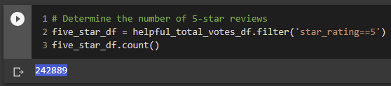

# Amazon Vine Analysis
## Overview of the analysis
The following analysis of Amazon reviews of books examines whether there is a positive bias in the reviews of books by Vine members. 

## Method: 
The analysis was performed using PySpark in the following steps: 
1. Book dataset was reduced to a dataframe containing "review_id", "star_rating", "helpful_votes", "total_votes", "vine", "verified_purchase" columns. The dataframe was further filtered to retrieve the rows where <total_votes> is equal to or greated than 20.
2.  Further filter the DataFrame to retrieve all the rows where half of the <total_votes> is <helpful_votes>
3.  Further filter the DataFrame first for rows that contain paid reviews, then for rows that contain unpaid reviews. 
4.  Analysis of distribution of 5-star votes in paid and unpaid reviews.

## Results: 
* There are a total of 0 Vine reviews when dataset is filtered for rows that contain total_votes > 20. This is confirmed by filtering the original dataset for Vine reviews. Note that both rows contain <total_votes> less than 20, therefore were left out.

* There are a total of 403807 unpaid, or non-Vine reviews, i.e. the total number of votes in the filtered dataset. 

* Given that there are 0 Vine reviews, all the 242889 5-star reviews were done by non-Vine members.
 
Confirmation that all 5-star reviews are by non-Vine members

* 60% of the non-Vine reviews are 5-Star reviews.

Summary: 
Analysis shows no evidence of bias in the reviews given that nearly all the reviews were done by non-Vine members. Further analysis of two other book datasets (v1_01 and v1_00) was conducted 
